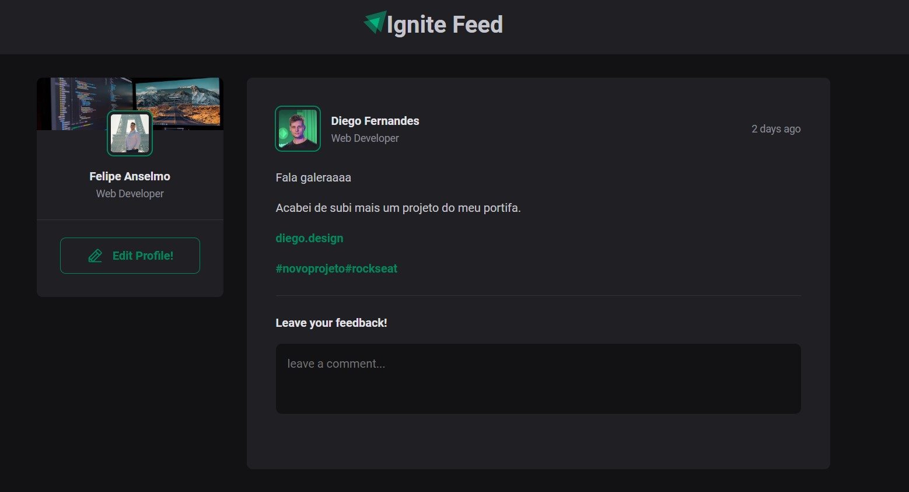

<h1 align="center">
	 Ignite Feed!
</h1>

<h3 align="center">
	Hello this is my  first timem using ReactJS, there are load of things in this Project that I've learnt so far things like Components, Properties, useState, Keys, CSS modules ...  if you would like to have look, follow the steps below, hope you enjoy it, thanks :)
</h3>

<p align="center">
	
	
	
	
</p>

<h4 align="center">
	Status: Finished.
</h4>

<p align="center">
	<a href="#tech-stack">Tech Stack</a> •
	<a href="#installation">Installation</a> •
	<a href="#usage">Usage</a> • 
	<a href="#contact">Contact</a> 
</p>

## Tech Stack
&nbsp;

<div align="center"> 
    
</div>

## Installation
To Install this project, follow the steps below:
```bash
git clone https://github.com/felipeanselmonascimento/
IgniteFeed
```

## Usage
To use this project, follow the steps below:
```bash
npm install

npm run dev
```

## Contact


by [felipeanselmonascimento](https://github.com/felipeanselmonascimento), get in touch!

<a href="mailto:felipeanselmodonascimento@gmail.com" target="_blank"></a>&nbsp;
<a href="https://www.linkedin.com/in/felipe-anselmo-do-nascimento-394042232/" target="_blank"></a>&nbsp;

<br clear="left"/>
